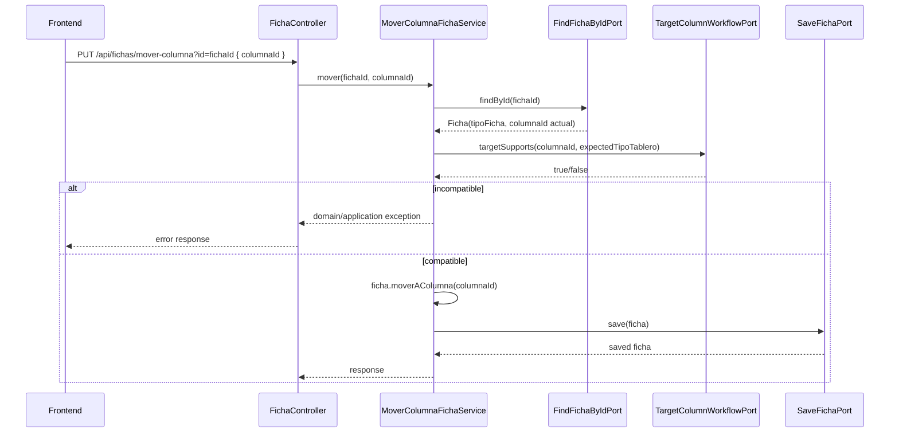

# Design: Kanban Workflow State Source

## Decision

Use the existing Kanban model as the workflow source:

- `TAREA` status = the current column of the task's `Ficha` in a `TAREAS` tablero.
- `TRATO` pipeline stage = the current column of the deal's `Ficha` in a `TRATOS` tablero.
- `Trato.estado` remains commercial outcome only: `ABIERTO`, `GANADO`, `PERDIDO`.

## Rationale

Adding `Tarea.estado` or `Trato.etapaPipelineId` now would duplicate `Ficha.columnaId` and create drift. Reintroducing `estado_tarea` / `estado_trato` in `columnas_tablero` would undo the current simplified board relation. The smallest safe design is to harden movement validation and clarify default column semantics.

## Backend Flow

## Layer Responsibilities

### domain

- Keep `Ficha` responsible for changing its own `columnaId`.
- Keep `Trato` outcome transitions in `ganar` / `perder`.
- Do not add framework/JPA concerns.

### application

- `MoverColumnaFichaService` orchestrates compatibility validation.
- Add a granular output port if existing ports cannot answer whether a column belongs to a compatible tablero type.

### infrastructure

- Implement the compatibility port through JPA adapters.
- Keep REST controllers thin.

### boot

- Wire any new service/port implementation if composition root requires it.

## Migration / Existing Data

Default TRATOS column labels SHOULD change for newly created boards. Existing boards are not renamed automatically in this change unless an idempotent migration already exists and is safe. This avoids destructive surprise edits to user-configured columns.

## Tests

- Domain: `TableroTest` for default column labels.
- Application: `MoverColumnaFichaServiceTest` for valid/invalid target type.
- Infrastructure: repository adapter test for target column compatibility query.
- Controller: only if existing controller test pattern covers movement error mapping cheaply.
